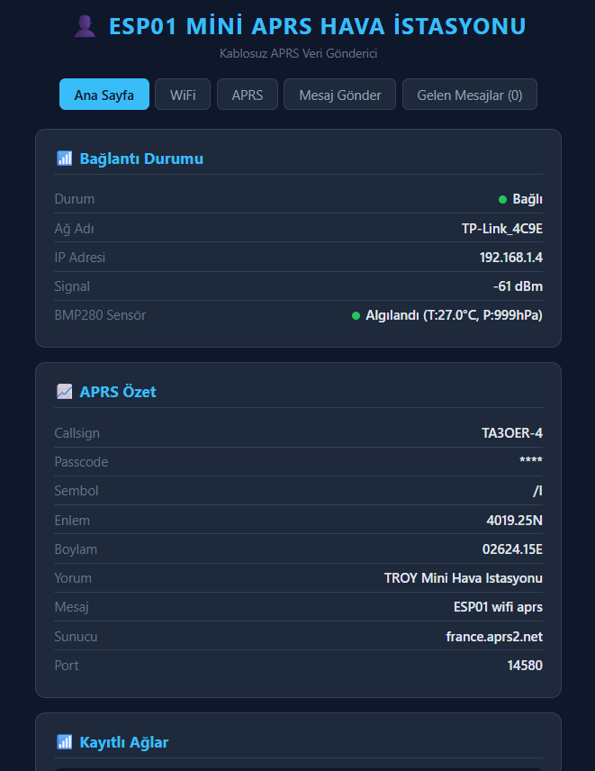
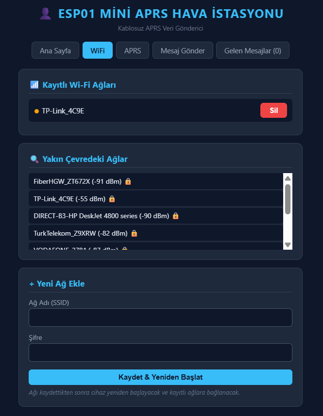
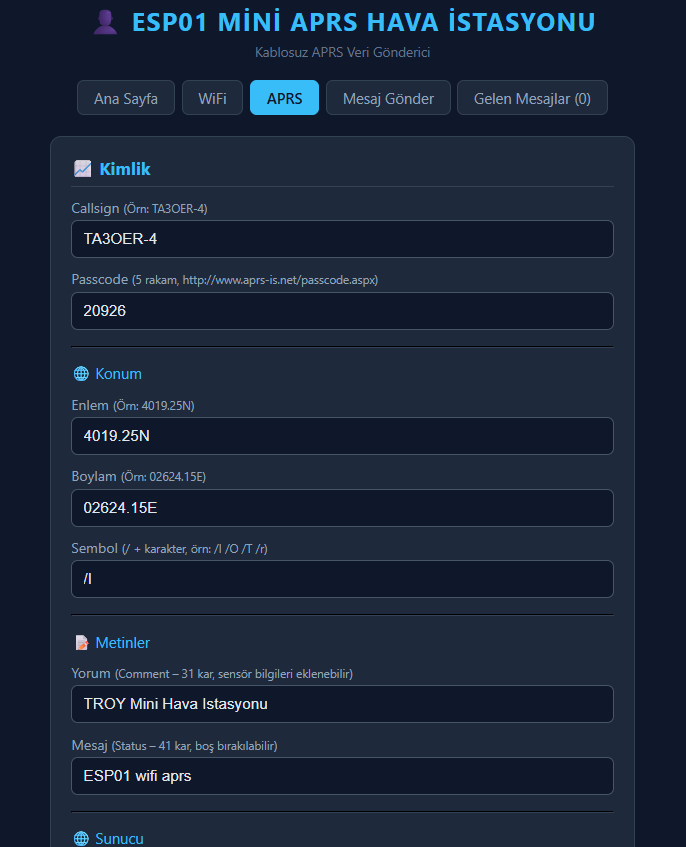
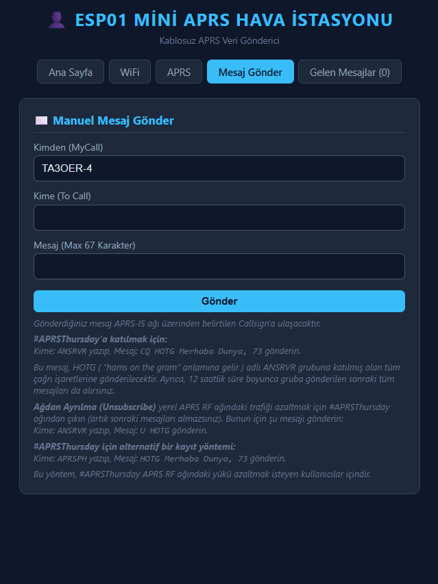
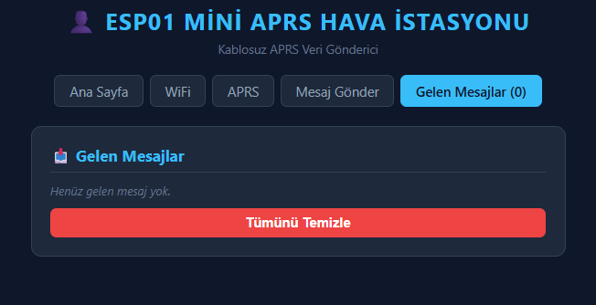

# 📡 ESP01 Mini APRS Hava İstasyonu

ESP-01 modülü ve BMP280 sensörü kullanarak kablosuz APRS (Automatic Packet Reporting System) veri gönderen mini hava istasyonu projesi. Web tabanlı yapılandırma arayüzü ile kolay kurulum.

## ✨ Özellikler

### 🌐 WiFi Yönetimi
- **Captive Portal**: İlk açılışta otomatik AP modu
- **Çoklu Ağ Desteği**: 4 farklı WiFi ağı kaydedilebilir
- **Akıllı Bağlantı**: En güçlü sinyalli ağa otomatik bağlanma
- **Ağ Tarayıcı**: Çevredeki WiFi ağlarını görüntüleme

### 📡 APRS Özellikleri
- **Otomatik Konum Raporları**: Belirlenen aralıklarla konum bildirimi (15 dakika varsayılan)
- **Hava Durumu Verileri**: BMP280 sensöründen sıcaklık ve basınç bilgisi
- **Manuel Mesajlaşma**: İki yönlü APRS mesajlaşma desteği
- **Gelen Kutusu**: Alınan mesajları görüntüleme ve yönetme
- **APRSThursday Desteği**: HOTG grubuna katılım için hazır komutlar

### 🌡️ Sensör Entegrasyonu
- **BMP280 Barometrik Sensör**:
  - Sıcaklık ölçümü (°C)
  - Atmosferik basınç (hPa)
  - Otomatik veri ekleme (konum ve durum mesajlarına)

### 🖥️ Web Arayüzü
- **Responsive Tasarım**: Mobil ve masaüstü uyumlu
- **Karanlık Tema**: Modern, göz dostu arayüz
- **Gerçek Zamanlı Durum**: WiFi, sensör ve APRS bağlantı bilgileri
- **Hafıza İzleme**: RAM ve Flash kullanım istatistikleri

## 🛠️ Gerekli Donanım

| Bileşen | Açıklama | Adet |
|---------|----------|------|
| ESP-01 (ESP8266) | WiFi modülü (1MB Flash) | 1 |
| BMP280 | Basınç ve sıcaklık sensörü | 1 |
| Pull-up Direnç | 4.7kΩ veya 10kΩ (I2C için) | 2 |
| USB-TTL Dönüştürücü | Programlama için (FTDI/CH340) | 1 |

### 📌 Pin Bağlantıları

```
ESP-01          BMP280
──────────────────────────
GPIO0 (SDA) ──→ SDA
GPIO2 (SCL) ──→ SCL
3.3V        ──→ VCC
GND         ──→ GND
```

> ⚠️ **Önemli**: Ben kullanmadım ama gerekli olabilir. GPIO0 ve GPIO2 pinleri normal çalışma için HIGH seviyede olmalıdır. 4.7kΩ pull-up dirençleri ekleyin!

## 📥 Kurulum

### Adım 1: Arduino IDE Kurulumu

1. **Arduino IDE'yi İndirin**: [arduino.cc](https://www.arduino.cc/en/software)

2. **ESP8266 Board Desteği**:
   - `Dosya` → `Tercihler` → `Ek Kart Yöneticisi URL'leri`
   - Ekleyin: `http://arduino.esp8266.com/stable/package_esp8266com_index.json`
   - `Araçlar` → `Kart` → `Kart Yöneticisi` → "ESP8266" ara ve yükle

3. **Gerekli Kütüphaneler**:
   ```
   Sketch → Kütüphane Ekle → Kütüphaneleri Yönet
   ```
   Aşağıdaki kütüphaneleri yükleyin:
   - `Adafruit BMP280 Library` (by Adafruit)

### Adım 2: Kodu Yükleme

1. **Projeyi klonlayın**:
   ```bash
   git clone https://github.com/KULLANICI_ADINIZ/esp01-aprs-weather.git
   cd esp01-aprs-weather
   ```

2. **Arduino IDE'de açın**:
   - `esp01_aprs_v7.ino` dosyasını açın

3. **Kart ayarları**:
   - `Araçlar` → `Kart` → `Generic ESP8266 Module`
   - `Flash Size`: `1MB (FS:64KB OTA:~470KB)`
   - `Upload Speed`: `115200`
   - `Port`: USB-TTL dönüştürücünüzün port'u

4. **Yükleme modu**:
   - GPIO0'ı GND'ye bağlayın (FLASH modu)
   - Arduino IDE'den yükleyin
   - GPIO0 bağlantısını çıkarın
   - ESP-01'i yeniden başlatın

### Adım 3: İlk Yapılandırma

1. **AP Moduna Bağlanma**:
   - ESP-01 ilk açılışta `ESP01_APRS` adında WiFi ağı oluşturur
   - Şifre: `aprs1234`
   - Tarayıcınızda açın: `http://192.168.4.1`

2. **WiFi Yapılandırması**:
   - "WiFi" sekmesine gidin
   - Çevredeki ağları tarayın
   - Ağınızı seçip şifresini girin
   - "Kaydet & Yeniden Başlat"

3. **APRS Ayarları**:
   - "APRS" sekmesine gidin
   - Bilgilerinizi girin:
     ```
     Callsign:  TA3OER-4
     Passcode:  12345 (aprs-is.net/passcode.aspx adresinden alın)
     Enlem:     4019.25N (DDMM.MMN formatında)
     Boylam:    02624.15E (DDDMM.MME formatında)
     Sembol:    /I (İstasyon simgesi)
     ```

## 📖 Kullanım

### Ana Sayfa
- **Bağlantı Durumu**: WiFi ve APRS bağlantı bilgileri
- **BMP280 Verileri**: Gerçek zamanlı sıcaklık ve basınç
- **APRS Özeti**: Yapılandırma bilgileri
- **Hafıza Durumu**: Sistem kaynak kullanımı

### Mesaj Gönderme
Manuel APRS mesajı göndermek için:
```
Kime:  TA3XXX-5
Mesaj: Merhaba, test mesajı 73!
```

### APRSThursday Katılımı
HOTG grubuna katılmak için:
```
Kime:  ANSRVR
Mesaj: CQ HOTG Merhaba Dunya, 73
```

### Gelen Mesajlar
- Alınan mesajlar otomatik olarak "Gelen Mesajlar" sekmesinde görünür
- Okunmamış mesajlar sarı ile vurgulanır
- "Okundu" olarak işaretleyebilir veya tümünü silebilirsiniz

## ⚙️ Yapılandırma

### APRS Gönderim Aralığı
`loop()` fonksiyonunda değiştirin:
```cpp
static const long APRS_INTERVAL = 900000L; // 15 dakika (ms)
```

Önerilen değerler:
- `180000L` → 3 dakika (test için)
- `900000L` → 15 dakika (varsayılan)
- `1800000L` → 30 dakika (normal kullanım)

### BMP280 I2C Adresi
Bazı BMP280 modülleri 0x76 adresi kullanır:
```cpp
if (!bmp.begin(0x76)) { // 0x76 yerine 0x77
```

### APRS-IS Sunucusu
Varsayılan: `france.aprs2.net:14580`

Alternatifler:
- `euro.aprs2.net`
- `turkey.aprs2.net`
- `asia.aprs2.net`

## 🔍 Sorun Giderme

### BMP280 Algılanmıyor
- Pull-up dirençleri takılı mı? (4.7kΩ - 10kΩ)
- I2C adresini kontrol edin (0x76 veya 0x77)
- Kablo bağlantılarını kontrol edin

### WiFi Bağlanamıyor
- SSID ve şifre doğru mu?
- Sinyal gücü yeterli mi?
- 2.4GHz ağ mı? (ESP8266 sadece 2.4GHz destekler)
- MAC filtresi var mı?

### APRS Mesajları Gitmiyor
- Callsign ve passcode doğru mu?
- [aprs.fi](https://aprs.fi) adresinden kontrol edin
- Serial Monitor çıktısını inceleyin
- Sunucu bağlantısı kontrol edin

## 📊 Teknik Özellikler

- **Platform**: ESP8266 (ESP-01)
- **Flash**: 1MB (kullanılabilir ~470KB)
- **RAM**: ~40KB serbest (çalışma zamanı)
- **WiFi**: 802.11 b/g/n (2.4GHz)
- **APRS Protokolü**: APRS-IS (TCP/IP)
- **Sensör**: BMP280 (I2C)
- **Web Server**: Port 80

## 🗺️ Yol Haritası

- [x] WiFi yapılandırma arayüzü
- [x] BMP280 sensör entegrasyonu
- [x] APRS konum raporları
- [x] İki yönlü mesajlaşma
- [x] Gelen kutusu
- [ ] OLED ekran desteği
- [ ] OTA (Over-The-Air) güncelleme

## 📸 Ekran Görüntüleri

### Ana Sayfa


### WiFi Yapılandırma


### APRS Ayarları


### Mesaj Gönder


### Gelen Mesajlar


**TA3OER 73** 📡
